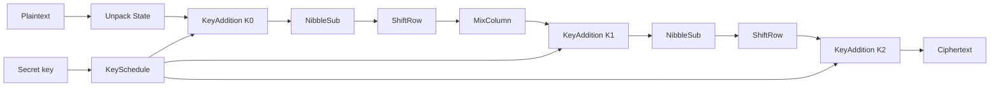

# Mini-AES Process Plan

This document explains **what the program does** and **how data moves** through the simulation. For algorithm parameters and the public API, see [README.md](README.md). For C++ language concepts used in the code, see [theory/Theory_CodeRef.html](theory/Theory_CodeRef.html).

---

## 1. Purpose

Mini-AES-Cpp is an educational implementation of Raphael Phan’s **Mini-AES** (Cryptologia, 2002): a 16-bit block cipher with a 16-bit key and two rounds. It mirrors the structure of real AES so students can trace every nibble by hand.

The executable built from `source/main.cpp` is a **traceable simulation**, not a production crypto library. It:

1. Expands a secret key into round keys `K0`, `K1`, `K2`
2. Encrypts the paper’s **Example 9** plaintext with a step-by-step state dump
3. Decrypts the ciphertext the same way
4. Checks that ciphertext matches `0x72C6` and that decryption recovers the plaintext
5. Exits `0` on success, `1` on mismatch

| Input | Value |
|-------|-------|
| Plaintext | `0x9C63` |
| Secret key | `0xC3F0` |
| Expected ciphertext | `0x72C6` |

**Not secure for real data.** The cipher is intentionally tiny so cryptanalysis exercises remain feasible.

---

## 2. Data Model

A 16-bit block is four **nibbles** (4-bit values), packed MSB → LSB as `(c0, c1, c2, c3)`.

They are laid out as a **2×2 column-oriented matrix** (matching Phan’s figures):

```
| c0  c2 |
| c1  c3 |
```

- Column 0 = `(c0, c1)`, column 1 = `(c2, c3)`
- Packing / unpacking lives in [`include/mini_aes/state.hpp`](include/mini_aes/state.hpp) (`State::from_uint16`, `to_uint16`)
- Each nibble is a `Nibble` in GF(2⁴) with modulus `x⁴ + x + 1` ([`gf16.hpp`](include/mini_aes/gf16.hpp))

---

## 3. Module Map

| Module | Role |
|--------|------|
| [`gf16.hpp`](include/mini_aes/gf16.hpp) | `Nibble` type; compile-time GF(2⁴) multiply table; XOR as addition |
| [`sbox.hpp`](include/mini_aes/sbox.hpp) | Forward / inverse S-boxes; `sbox` / `inv_sbox` helpers |
| [`state.hpp`](include/mini_aes/state.hpp) | 2×2 state, packing, column accessors, trace printing |
| [`transforms.hpp`](include/mini_aes/transforms.hpp) | NibbleSub (γ), ShiftRow (π), MixColumn (θ), KeyAddition (σ_K) |
| [`key_schedule.hpp`](include/mini_aes/key_schedule.hpp) | Expand 16-bit key → `K0`, `K1`, `K2` |
| [`cipher.hpp`](include/mini_aes/cipher.hpp) | `Cipher::encrypt` / `decrypt` with optional trace callback |
| [`mini_aes.hpp`](include/mini_aes/mini_aes.hpp) | Umbrella include for the library |
| [`source/main.cpp`](source/main.cpp) | Demo driver: Example 9 + pass/fail checks |

Build wiring: [`CMakeLists.txt`](CMakeLists.txt) compiles `source/main.cpp` as `mini_aes` with `include/` on the include path (C++20).

---

## 4. Key Schedule Process

Constructor of `KeySchedule` (secret key `K`):

1. Unpack `K` into nibbles `(k0, k1, k2, k3)`
2. **`K0`** = `(k0, k1, k2, k3)`
3. Derive words for round 1:
   - `w4 = k0 ⊕ S(k3) ⊕ rcon(1)` where `rcon(i) = i`
   - `w5 = k1 ⊕ w4`
   - `w6 = k2 ⊕ w5`
   - `w7 = k3 ⊕ w6`
   - **`K1`** = `(w4, w5, w6, w7)`
4. Derive words for round 2:
   - `w8 = w4 ⊕ S(w7) ⊕ rcon(2)`
   - `w9 = w5 ⊕ w8`
   - `w10 = w6 ⊕ w9`
   - `w11 = w7 ⊕ w10`
   - **`K2`** = `(w8, w9, w10, w11)`

`Cipher` builds the schedule once at construction and reuses it for encrypt and decrypt.

---

## 5. Encryption Process

Paper composition (functions apply right-to-left):

```
E = σ_K2 ∘ π ∘ γ ∘ σ_K1 ∘ θ ∘ π ∘ γ ∘ σ_K0
```

Concrete order in `Cipher::encrypt`:



| Step | Transform | Notes |
|------|-----------|-------|
| 1 | Unpack plaintext → `State` | |
| 2 | KeyAddition with `K0` | Whitening |
| 3 | NibbleSub | S-box each nibble |
| 4 | ShiftRow | `(c0,c1,c2,c3) → (c0,c3,c2,c1)` |
| 5 | MixColumn | Each column × `[[3,2],[2,3]]` over GF(2⁴) |
| 6 | KeyAddition with `K1` | End of round 1 |
| 7 | NibbleSub | Start of round 2 |
| 8 | ShiftRow | |
| 9 | KeyAddition with `K2` | **No MixColumn** in the final round (same structural idea as AES) |
| 10 | Pack → `uint16_t` | |

If a `TraceCallback` is supplied, the cipher invokes it after each labeled step so the demo can print the 2×2 matrix.

---

## 6. Decryption Process

Paper composition:

```
D = σ_K0 ∘ π ∘ γ⁻¹ ∘ θ ∘ σ_K1 ∘ π ∘ γ⁻¹ ∘ σ_K2
```

Order in `Cipher::decrypt`:

1. Unpack ciphertext
2. KeyAddition with `K2`
3. ShiftRow (same function as encrypt — **self-inverse** on this layout)
4. InvNibbleSub (`nibble_sub(..., inverse=true)`)
5. KeyAddition with `K1`
6. MixColumn (same function — matrix chosen so **θ = θ⁻¹**)
7. ShiftRow
8. InvNibbleSub
9. KeyAddition with `K0`
10. Pack → recovered plaintext

Because π and θ are their own inverses, decryption reuses `shift_row` and `mix_column` instead of separate inverse transforms. Only NibbleSub needs a distinct inverse S-box.

---

## 7. Demo Program Flow (`main.cpp`)

1. Print a short banner
2. Print plaintext and secret key in hex
3. Construct `Cipher(0xC3F0)` (runs key schedule)
4. Print round keys `K0`–`K2`
5. **Encrypt** with `trace_state` callback → print ciphertext → PASS/FAIL vs `0x72C6`
6. **Decrypt** with the same callback → print recovered plaintext → PASS/FAIL round-trip
7. Return `0` only if both checks succeed

The callback type is `std::function<void(std::string_view, const State&)>`. Omitting it (default `{}`) skips tracing for a quiet encrypt/decrypt call.

---

## 8. Build and Run

Same commands as the README:

```bash
cmake -S . -B build
cmake --build build
./build/mini_aes
```

Requires a C++20 compiler and CMake 3.16+.

---

## Quick Mental Model

Think of the simulation as:

**key → three round keys → plaintext nibbles walk through AES-like layers → ciphertext**, then the reverse walk for decryption, with optional printing after every layer so you can compare against the paper by hand.
